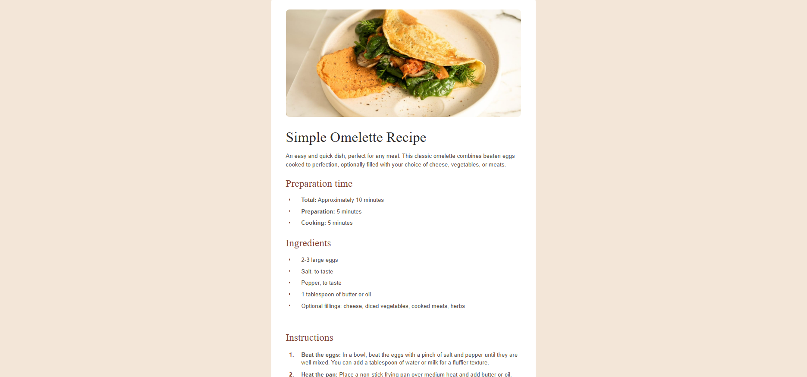

# Frontend Mentor - Recipe page solution

This is a solution to the [Recipe page challenge on Frontend Mentor](https://www.frontendmentor.io/challenges/recipe-page-KiTsR8QQKm). Frontend Mentor challenges help you improve your coding skills by building realistic projects.

## Overview

This is a very basic project of a recipe main page made using HTML and CSS and deployed using Github.

### Screenshot

### Built with

- Semantic HTML5 markup
- CSS custom properties
- Flexbox
- CSS Grid
- [Styled Components](https://styled-components.com/) - For styles

### Useful resources

- MDN website
- w3school website

## Author

- linkedIn - [Jyotsna Shrivatava] (https://www.linkedin.com/in/jyostna-shrivastava-78b5192b2)

- Frontend Mentor - [@jyotsna030](https://www.frontendmentor.io/profile/jyotsna030)

- Instagram - [@jyotsnas03](https://www.instagram.com/jyotsnas03?igsh=MTRnZGxncmZycnJsNw==)
